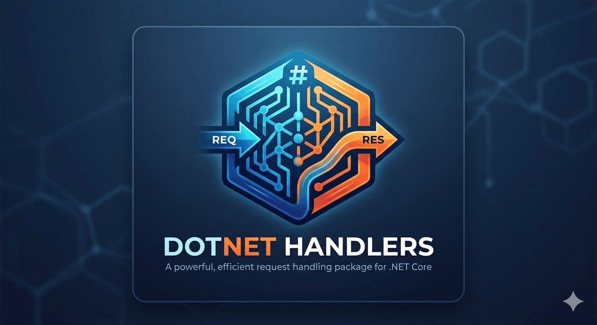

# DotnetHandler

<p align="center">
  
</p>

<p align="center">
  <strong>A lightweight, modular request handling package for .NET.</strong>
</p>

A lightweight, modular .NET Standard library that provides request/response handlers, a pipeline, an event bus, built-in validation, and a fluent registration API — all with zero forced patterns.

---

## Features

| Feature | Description |
|---|---|
| **Dispatcher** | Unified `IDispatcher` with `Send` (1:1) and `Publish` (1:N) |
| **Handlers** | Strongly-typed `IRequestHandler<TRequest, TResponse>` |
| **Validation** | Automatic, opt-in per-handler via `IValidationHandler<TRequest>` |
| **Pipeline** | Ordered middleware via `IPipelineBehavior<TRequest, TResponse>` |
| **Events** | Fire-and-forget pub/sub via `IEvent` / `IEventListener<TEvent>` |
| **Fluent API** | Coravel-style registration with `AddApplication(...)` |
| **Assembly scanning** | MediatR-style auto-discovery via `FromAssembly(...)` |
| **Modular** | Use only the modules you need |

---

## Installation

Add a project reference to `DotnetHandler` (NuGet package coming soon).

---

## Quick Start

### 1. Define a request

```csharp
public record CreateUserCommand(string Name, string Email) : IRequest<User>;
```

### 2. Implement a handler (with optional built-in validation)

```csharp
public class CreateUserHandler
    : IRequestHandler<CreateUserCommand, User>,
      IValidationHandler<CreateUserCommand>   // optional
{
    public Task<ValidationResult> ValidateAsync(CreateUserCommand request)
    {
        if (string.IsNullOrWhiteSpace(request.Name))
            return Task.FromResult(ValidationResult.Failure("Name is required."));

        return Task.FromResult(ValidationResult.Success());
    }

    public Task<User> HandleAsync(CreateUserCommand request) =>
        Task.FromResult(new User(Guid.NewGuid(), request.Name, request.Email));
}
```

### 3. Register

```csharp
builder.Services.AddDotnetHandler(app =>
{
    app.Handlers(h =>
        h.Register<CreateUserCommand, User>().HandledBy<CreateUserHandler>());

    app.Events(e =>
        e.Register<UserCreatedEvent>().Subscribe<SendWelcomeEmailListener>());

    // Open-generic behaviors use the Type overload
    app.Pipeline(p =>
        p.Use(typeof(LoggingBehavior<,>)));
});
```

### 4. Dispatch

```csharp
app.MapPost("/users", async (CreateUserCommand cmd, IDispatcher dispatcher) =>
{
    try
    {
        var user = await dispatcher.Send(cmd);
        return Results.Ok(user);
    }
    catch (ValidationException ex)
    {
        return Results.BadRequest(new { errors = ex.Errors });
    }
});
```

---

## Core Abstractions

### Requests & Handlers

```csharp
public interface IRequest<TResponse> { }

public interface IRequestHandler<TRequest, TResponse>
{
    Task<TResponse> HandleAsync(TRequest request);
}
```

### Events

```csharp
public interface IEvent { }

public interface IEventListener<TEvent>
{
    Task HandleAsync(TEvent @event);
}
```

### Pipeline

```csharp
public interface IPipelineBehavior<TRequest, TResponse>
{
    Task<TResponse> HandleAsync(TRequest request, Func<Task<TResponse>> next);
}
```

### Validation

```csharp
public interface IValidationHandler<TRequest>
{
    Task<ValidationResult> ValidateAsync(TRequest request);
}
```

Validation runs automatically **before** the handler and pipeline when the handler also implements `IValidationHandler<TRequest>`. A `ValidationException` is thrown on failure — no manual wiring needed.

---

## Dispatcher Behaviour

| Operation | Validation | Pipeline | Listeners | Throws if none |
|---|---|---|---|---|
| `Send` | ✅ (if handler implements `IValidationHandler`) | ✅ | — | ✅ |
| `Publish` | ❌ | ❌ | All matching | ❌ |

---

## Assembly Scanning

```csharp
builder.Services.AddDotnetHandler(app =>
    app.FromAssembly(typeof(Program).Assembly));
```

**Auto-registers:** `IRequestHandler<,>`, `IEventListener<>`  
**Does NOT auto-register:** pipeline behaviors, validation behaviors (explicit only)


## Pipeline Behaviors

### Closed (single request type)

```csharp
app.Pipeline(p => p.Use<MyBehavior>());
```

### Open generic (all requests)

```csharp
app.Pipeline(p => p.Use(typeof(LoggingBehavior<,>)));
```

Behaviors execute in registration order (first registered = outermost wrapper).

---

## Validation Details

`ValidationResult` is a simple value object:

```csharp
ValidationResult.Success();
ValidationResult.Failure("Error 1", "Error 2");
```

`ValidationException` exposes `IReadOnlyCollection<string> Errors`.

---

## Project Structure

```
DotnetHandler.sln
├── src/
│   └── DotnetHandler/              # Core library (netstandard2.1)
│       ├── Abstractions/           # Interfaces
│       ├── Core/                   # Dispatcher implementation
│       ├── Validation/             # ValidationResult, ValidationException
│       ├── Registration/           # Fluent API, ApplicationBuilder
│       └── Internal/               # Assembly scanner
├── tests/
│   └── DotnetHandler.Tests/        # xUnit tests (net8.0)
└── samples/
    └── DotnetHandler.Sample/       # Minimal API sample (net8.0)
```

---

## Design Goals

- As **simple** as Coravel
- As **structured** as MediatR
- **Built-in** validation without a framework dependency
- **No enforced** response pattern (return whatever `TResponse` you want)
- **Explicit** and predictable — no magic beyond optional assembly scanning
