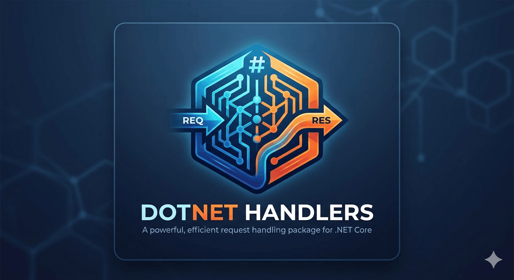

# DotnetHandler

<p align="center">
  
</p>

<p align="center">
  <strong>A lightweight, modular request handling package for .NET.</strong>
</p>

A lightweight, modular .NET Standard library that provides request/response handlers, a pipeline, an event bus, built-in validation, and a fluent registration API — all with zero forced patterns.

---

## Features

| Feature | Description |
|---|---|
| **Dispatcher** | Unified `IDispatcher` with `Send` (1:1) and `Publish` (1:N) |
| **Handlers** | Strongly-typed `IRequestHandler<TRequest, TResponse>` |
| **Validation** | Automatic, opt-in per-handler via `IValidationHandler<TRequest>` |
| **Pipeline** | Ordered middleware via `IPipelineBehavior<TRequest, TResponse>` |
| **Events** | Fire-and-forget pub/sub via `IEvent` / `IEventListener<TEvent>` |
| **Cache Behavior** | Opt-in response caching via `ICacheableRequest<TResponse>` |
| **Permission Behavior** | Opt-in authorization via `IAuthorizedRequest` + `IPermissionContext` |
| **Idempotency Behavior** | Duplicate-request prevention via `IIdempotentRequest` |
| **Fluent API** | Explicit registration with `AddDotnetHandler(...)` |
| **Source Generator** | Zero-reflection registration via `UseGeneratedHandlers()` |
| **Assembly scanning** | Reflection-based auto-discovery via `FromAssembly(...)` (legacy) |
| **Modular** | Use only the modules you need |

---

## Installation

[](https://www.nuget.org/packages/DotnetHandler/)

---

## Quick Start

### 1. Define a request

```csharp
public record CreateUserCommand(string Name, string Email) : IRequest<User>;
```

### 2. Implement a handler (with optional built-in validation)

```csharp
public class CreateUserHandler
    : IRequestHandler<CreateUserCommand, User>,
      IValidationHandler<CreateUserCommand>   // optional
{
    public Task<ValidationResult> ValidateAsync(CreateUserCommand request)
    {
        if (string.IsNullOrWhiteSpace(request.Name))
            return Task.FromResult(ValidationResult.Failure("Name is required."));

        return Task.FromResult(ValidationResult.Success());
    }

    public Task<User> HandleAsync(CreateUserCommand request) =>
        Task.FromResult(new User(Guid.NewGuid(), request.Name, request.Email));
}
```

### 3. Register

**Recommended — source generator (zero reflection):**

```csharp
// All IRequestHandler<,> and IEventListener<> in this assembly are registered automatically.
builder.Services.AddDotnetHandler(app =>
{
    app.UseGeneratedHandlers();

    // Pipeline behaviors are always explicit (open-generic supported)
    app.Pipeline(p => p.Use(typeof(LoggingBehavior<,>)));
});
```

**Alternative — fluent (explicit, no generator needed):**

```csharp
builder.Services.AddDotnetHandler(app =>
{
    app.Handlers(h =>
        h.Register<CreateUserCommand, User>().HandledBy<CreateUserHandler>());

    app.Events(e =>
        e.Register<UserCreatedEvent>().Subscribe<SendWelcomeEmailListener>());

    app.Pipeline(p => p.Use(typeof(LoggingBehavior<,>)));
});
```

### 4. Dispatch

```csharp
app.MapPost("/users", async (CreateUserCommand cmd, IDispatcher dispatcher) =>
{
    try
    {
        var user = await dispatcher.Send(cmd);
        return Results.Ok(user);
    }
    catch (ValidationException ex)
    {
        return Results.BadRequest(new { errors = ex.Errors });
    }
});
```

---

## Core Abstractions

### Requests & Handlers

```csharp
public interface IRequest<TResponse> { }

public interface IRequestHandler<TRequest, TResponse>
{
    Task<TResponse> HandleAsync(TRequest request);
}
```

### Events

```csharp
public interface IEvent { }

public interface IEventListener<TEvent>
{
    Task HandleAsync(TEvent @event);
}
```

### Pipeline

```csharp
public interface IPipelineBehavior<TRequest, TResponse>
{
    Task<TResponse> HandleAsync(TRequest request, Func<Task<TResponse>> next);
}
```

### Validation

```csharp
public interface IValidationHandler<TRequest>
{
    Task<ValidationResult> ValidateAsync(TRequest request);
}
```

Validation runs automatically **before** the handler and pipeline when the handler also implements `IValidationHandler<TRequest>`. A `ValidationException` is thrown on failure — no manual wiring needed.

### Behavior contracts

```csharp
// Opt-in response caching
public interface ICacheableRequest<TResponse>
{
    string CacheKey { get; }
    TimeSpan? CacheDuration { get; }
}

// Opt-in authorization
public interface IAuthorizedRequest
{
    IEnumerable<string> RequiredPermissions { get; }
}

// Current-user permission check (implement in your application)
public interface IPermissionContext
{
    bool HasPermission(string permission);
}

// Opt-in idempotency
public interface IIdempotentRequest
{
    string IdempotencyKey { get; }
}
```

---

## Dispatcher Behaviour

| Operation | Validation | Pipeline | Listeners | Throws if none |
|---|---|---|---|---|
| `Send` | ✅ (if handler implements `IValidationHandler`) | ✅ | — | ✅ |
| `Publish` | ❌ | ❌ | All matching | ❌ |

---

## Source Generator

The source generator ships with the package. It runs at compile time and emits a `UseGeneratedHandlers()` extension method for your assembly — no reflection at runtime.

**What it discovers automatically:**

| Type | Registered via |
|---|---|
| `IRequestHandler<TRequest, TResponse>` | `app.Handlers(...)` |
| `IEventListener<TEvent>` | `app.Events(...)` |

**What must remain explicit:**

| Type | Why |
|---|---|
| `IPipelineBehavior<,>` | Order matters — always declare in `app.Pipeline(...)` |
| FluentValidation validators | External dependency, not a DotnetHandler abstraction |

> Pipeline behaviors and external validators are not auto-registered by design.

### Usage

```csharp
builder.Services.AddDotnetHandler(app =>
{
    app.UseGeneratedHandlers();
    app.Pipeline(p => p.Use(typeof(LoggingBehavior<,>)));
});
```

The generated code is emitted to `obj/{config}/{tfm}/generated/DotnetHandler.SourceGenerators/.../*.g.cs` and is visible in your IDE.

---

## Assembly Scanning (legacy)

Runtime reflection fallback — useful for plugin scenarios or when source generators are unavailable:

```csharp
builder.Services.AddDotnetHandler(app =>
    app.FromAssembly(typeof(Program).Assembly));
```

**Auto-registers:** `IRequestHandler<,>`, `IEventListener<>`  
**Does NOT auto-register:** pipeline behaviors (always explicit)


## Pipeline Behaviors

### Closed (single request type)

```csharp
app.Pipeline(p => p.Use<MyBehavior>());
```

### Open generic (all requests)

```csharp
app.Pipeline(p => p.Use(typeof(LoggingBehavior<,>)));
```

Behaviors execute in registration order (first registered = outermost wrapper).

---

## Cache Behavior

Mark a query as cacheable by implementing `ICacheableRequest<TResponse>`:

```csharp
public record GetUsersQuery : IRequest<List<User>>, ICacheableRequest<List<User>>
{
    public string CacheKey => "users:all";
    public TimeSpan? CacheDuration => TimeSpan.FromMinutes(1); // null = 5 min default
}
```

Implement the behavior using `IMemoryCache` (or any cache abstraction):

```csharp
public class CacheBehavior<TRequest, TResponse>(IMemoryCache cache)
    : IPipelineBehavior<TRequest, TResponse>
{
    public async Task<TResponse> HandleAsync(TRequest request, Func<Task<TResponse>> next)
    {
        if (request is not ICacheableRequest<TResponse> cacheable)
            return await next();

        if (cache.TryGetValue(cacheable.CacheKey, out TResponse? cached))
            return cached!;

        var result = await next();
        cache.Set(cacheable.CacheKey, result, cacheable.CacheDuration ?? TimeSpan.FromMinutes(5));
        return result;
    }
}
```

Register:

```csharp
builder.Services.AddMemoryCache();
app.Pipeline(p => p.Use(typeof(CacheBehavior<,>)));
```

Non-cacheable requests pass through transparently.

---

## Permission Behavior

Implement `IPermissionContext` to provide the current user's permissions:

```csharp
public interface IPermissionContext
{
    bool HasPermission(string permission);
}
```

Mark a command as requiring authorization by implementing `IAuthorizedRequest`:

```csharp
public record DeleteUserCommand(Guid Id) : IRequest<bool>, IAuthorizedRequest
{
    public IEnumerable<string> RequiredPermissions => ["users:delete"];
}
```

Implement the behavior:

```csharp
public class PermissionBehavior<TRequest, TResponse>(IPermissionContext context)
    : IPipelineBehavior<TRequest, TResponse>
{
    public async Task<TResponse> HandleAsync(TRequest request, Func<Task<TResponse>> next)
    {
        if (request is not IAuthorizedRequest authorized)
            return await next();

        foreach (var permission in authorized.RequiredPermissions)
        {
            if (!context.HasPermission(permission))
                throw new UnauthorizedException(permission);
        }

        return await next();
    }
}
```

`UnauthorizedException` exposes the `Permission` property. Catch it at the endpoint to return 403:

```csharp
app.MapDelete("/users/{id:guid}", async (Guid id, IDispatcher dispatcher) =>
{
    try { ... }
    catch (UnauthorizedException ex)
    {
        return Results.Problem(ex.Message, statusCode: 403);
    }
});
```

---

## Idempotency Behavior

Mark a command as idempotent by implementing `IIdempotentRequest`:

```csharp
public record CreateUserCommand(string Name, string Email, string IdempotencyKey = "")
    : IRequest<UserResponse>, IIdempotentRequest;
```

The client sends the key in the `Idempotency-Key` header; the endpoint injects it into the command before dispatching. Repeated requests with the same key return the stored result without re-executing the handler.

Implement the behavior:

```csharp
public class IdempotencyBehavior<TRequest, TResponse>(IMemoryCache cache)
    : IPipelineBehavior<TRequest, TResponse>
{
    public async Task<TResponse> HandleAsync(TRequest request, Func<Task<TResponse>> next)
    {
        if (request is not IIdempotentRequest idempotent || string.IsNullOrWhiteSpace(idempotent.IdempotencyKey))
            return await next();

        var key = $"idempotency:{idempotent.IdempotencyKey}";
        if (cache.TryGetValue(key, out TResponse? stored))
            return stored!;

        var result = await next();
        cache.Set(key, result, TimeSpan.FromHours(24));
        return result;
    }
}
```

Requests with a blank `IdempotencyKey` bypass the behavior and always execute.

---

## Validation Details

`ValidationResult` is a simple value object:

```csharp
ValidationResult.Success();
ValidationResult.Failure("Error 1", "Error 2");
```

`ValidationException` exposes `IReadOnlyCollection<string> Errors`.

---

## Project Structure

```
DotnetHandler.sln
├── src/
│   ├── DotnetHandler/                  # Core library (netstandard2.1)
│   │   ├── Abstractions/               # Interfaces
│   │   ├── Core/                       # Dispatcher implementation
│   │   ├── Validation/                 # ValidationResult, ValidationException
│   │   ├── Registration/               # Fluent API, ApplicationBuilder
│   │   └── Internal/                   # Assembly scanner (legacy)
│   └── DotnetHandler.SourceGenerators/ # Roslyn source generator (netstandard2.0)
├── tests/
│   ├── DotnetHandler.Tests/            # Core unit tests (net10.0)
│   └── DotnetHandler.Sample.Tests/     # Integration tests for sample (net10.0)
└── samples/
    └── DotnetHandler.Sample/           # Minimal API sample (net10.0)
```

---

## Design Goals

- As **simple** as Coravel
- As **structured** as MediatR
- **Built-in** validation without a framework dependency
- **No enforced** response pattern (return whatever `TResponse` you want)
- **Explicit** and predictable — no magic beyond optional assembly scanning
